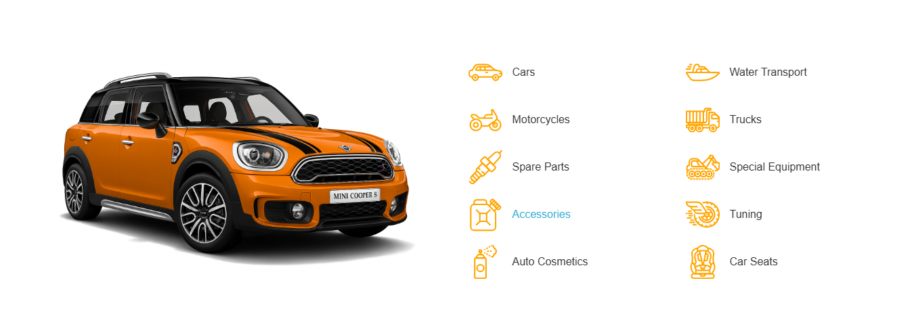
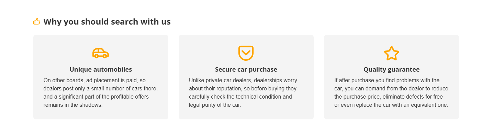
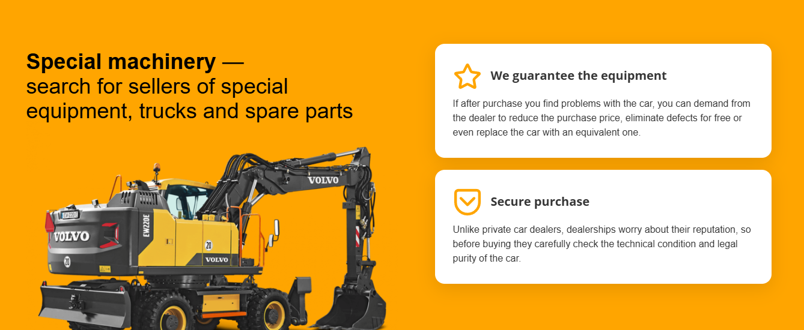
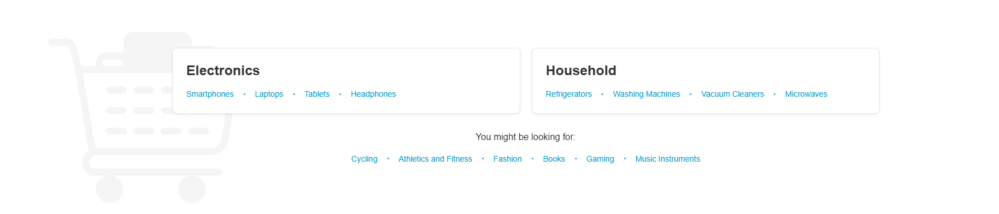

# Custom Blocks Theme for Tamaranga Platform

This theme provides a collection of customizable dynamic blocks for the Tamaranga Platform, specifically designed for automotive and marketplace websites. Each block can be fully customized through the admin panel with various settings and content options.

## Available Blocks

### 1. Auto Categories Block (`AutoCategoriesBlock`)

A visually appealing category display block with customizable icons and main image.

**Customizable Settings:**
- **Block Status**: Enable/disable the entire block
- **Main Image**: Upload a main background image for the block
- **Category Sections** (Dynamic Group):
  - **Category Icon**: SVG/image icon for each category
  - **Category Title**: Multilingual category name 
  - **Category Link**: URL to the category page 

**Predefined Categories:**
- Cars, Water Transport, Motorcycles, Trucks, Spare Parts, Special Equipment, Accessories, Tuning, Auto Cosmetics, Car Seats

**Template**: `tpl/auto.categories.block.php`

**Result**:

---

### 2. Benefits 1 Block (`Benefits1Block`)

A feature-rich benefits showcase block with customizable icons and descriptions.

**Customizable Settings:**
- **Block Title**: Main heading for the benefits section 
- **Title Icon**: Icon displayed next to the main title
- **Icons Color**: Color picker for benefit icons (#FFA500 default)
- **Benefits List** (Dynamic Group):
  - **Benefit Icon**: Individual icon for each benefit
  - **Benefit Title**: Benefit heading 
  - **Benefit Description**: Rich text description with WYSIWYG editor 

**Predefined Benefits:**
- Unique automobiles, Secure car purchase, Quality guarantee

**Template**: `tpl/benefits1.block.php`

**Result**:

---

### 3. Benefits 2 Block (`Benefits2Block`)

A split-layout benefits block with image on the left and benefits list on the right.

**Customizable Settings:**
- **Description**: Rich text description with HTML support 
- **Main Image**: Left-side image (defaults to excavator image)
- **Background Color**: Color picker for block background (#FFA500 default)
- **Benefits List** (Dynamic Group):
  - **Benefit Icon**: Individual icon for each benefit
  - **Benefit Title**: Benefit heading 
  - **Benefit Description**: Rich text description with WYSIWYG editor 

**Predefined Benefits:**
- Equipment guarantee, Secure purchase

**Template**: `tpl/benefits2.block.php`

**Result**:

---

### 4. Custom Categories Block (`CategoriesBlock`)

A comprehensive three-section category navigation block with left, right, and bottom sections.

**Customizable Settings:**
- **Block Logo**: General logo for the entire block
- **Left Category Block**:
  - **Enabled**: Toggle left section on/off
  - **Title**: Section heading  - default: "Electronics"
  - **Links** (Dynamic Group): Title and URL pairs 
- **Right Category Block**:
  - **Enabled**: Toggle right section on/off
  - **Title**: Section heading  - default: "Household"
  - **Links** (Dynamic Group): Title and URL pairs 
- **Bottom Suggestions Block**:
  - **Enabled**: Toggle bottom section on/off
  - **Title**: Section heading  - default: "You might be looking for:"
  - **Links** (Dynamic Group): Title and URL pairs 

**Predefined Categories:**
- Left: Smartphones, Laptops, Tablets, Headphones
- Right: Refrigerators, Washing Machines, Vacuum Cleaners, Microwaves
- Bottom: Cycling, Athletics & Fitness, Fashion, Books, Gaming, Music Instruments

**Template**: `tpl/categories.block.php`

**Result**:

---

### 5. Banner Block (`BannerBlock`)

A customizable promotional banner with call-to-action button.

**Customizable Settings:**
- **Banner Settings**:
  - **Enabled**: Toggle banner visibility
  - **Banner Text**: Main promotional message 
  - **Background Color**: Banner background color picker (#6366f1 default)
  - **Text Color**: Banner text color picker (#ffffff default)
- **Button Settings**:
  - **Enabled**: Toggle button visibility
  - **Button Text**: Call-to-action text 
  - **Button URL**: Link destination with macro support 
  - **Button Background**: Button background color (#f97316 default)
  - **Button Text Color**: Button text color (#ffffff default)

**URL Macros Support**: Supports site URL and host placeholder macros for dynamic links

**Template**: `tpl/banner1.php`

**Result**:


---

### Conditional Visibility
- Blocks use `visibleIf()` and `boundaryIn()` for conditional field display
- Parent settings control child field visibility
- Improves admin UX by hiding irrelevant fields

### Macro Support
Some blocks support URL macros for dynamic link generation:
- `{siteurl}`: Replaced with site base URL
- `{host}`: Replaced with site hostname

## Customization

### Adding New Predefined Options
Each block includes predefined content via `->preload()` calls in the `settingsForm()` method. To modify:

1. Edit the respective block file in `views/`
2. Update the `->preload([...])` arrays
3. Add/modify multilingual content arrays

### Styling Customization
- Main styles are in `static/css/` directory
- Each block has its own CSS file
- Modify templates in `tpl/` directory for structural changes

### Language Support
- All blocks support multilingual content
- Default languages: English (en) and Russian (ru)
- Add new languages by extending the arrays in `settingsForm()` methods

## File Structure

```
customblocks/
├── README.md                    # This documentation
├── index.php                    # Theme definition
├── views/                       # Block class files
│   ├── AutoCategoriesBlock.php
│   ├── Benefits1Block.php
│   ├── Benefits2Block.php
│   ├── CategoriesBlock.php
│   └── Banner1Block.php
├── tpl/                        # Block templates
│   ├── auto.categories.block.php
│   ├── benefits1.block.php
│   ├── benefits2.block.php
│   ├── categories.block.php
│   └── banner1.php
└── static/                     # Assets
    ├── css/                    # Stylesheets
    └── img/                    # Images and icons
```

## Support

For questions about customizing these blocks or adding new functionality, refer to the Tamaranga Platform documentation or contact your development team.